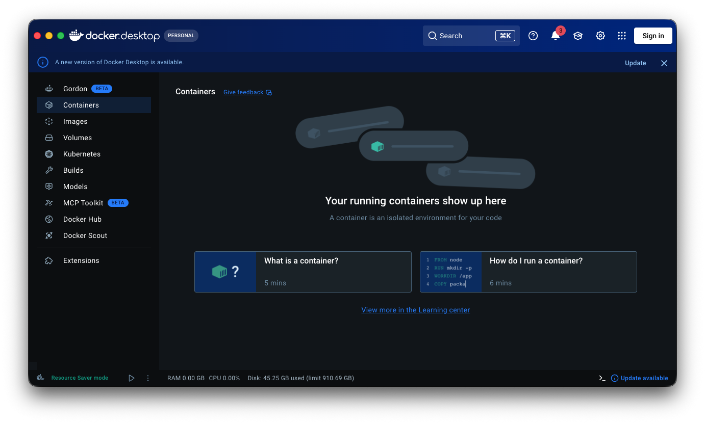
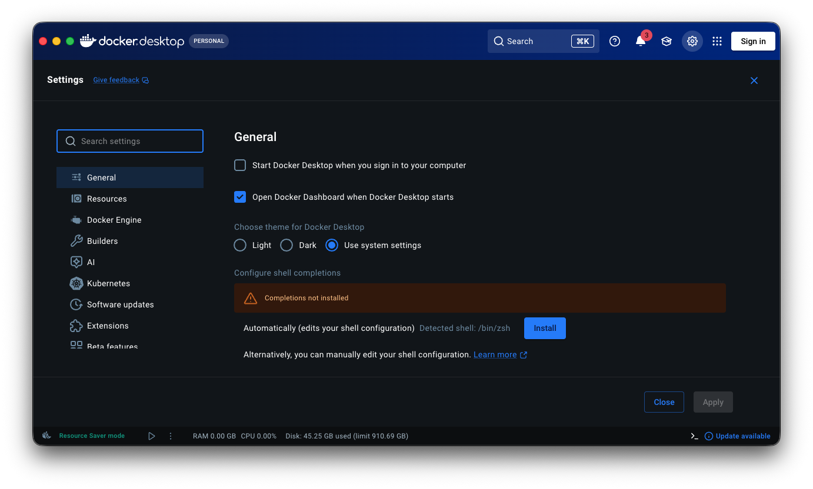
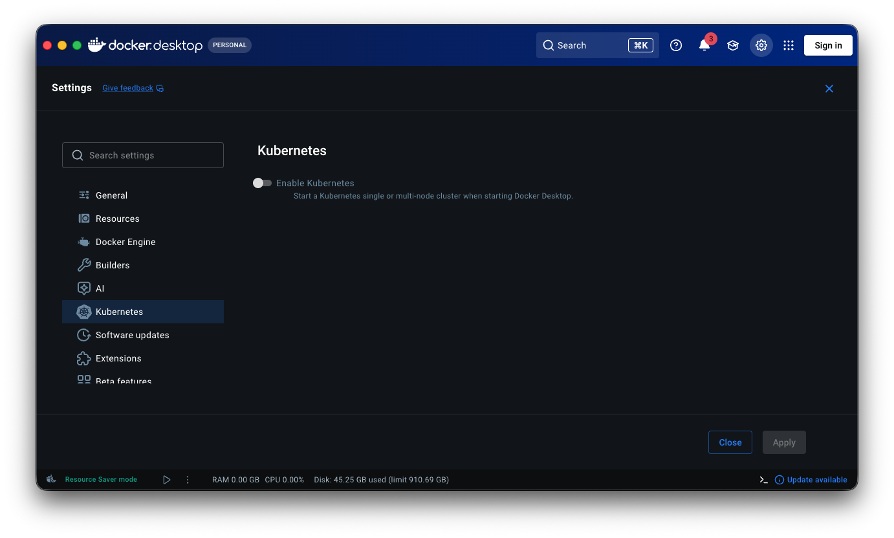
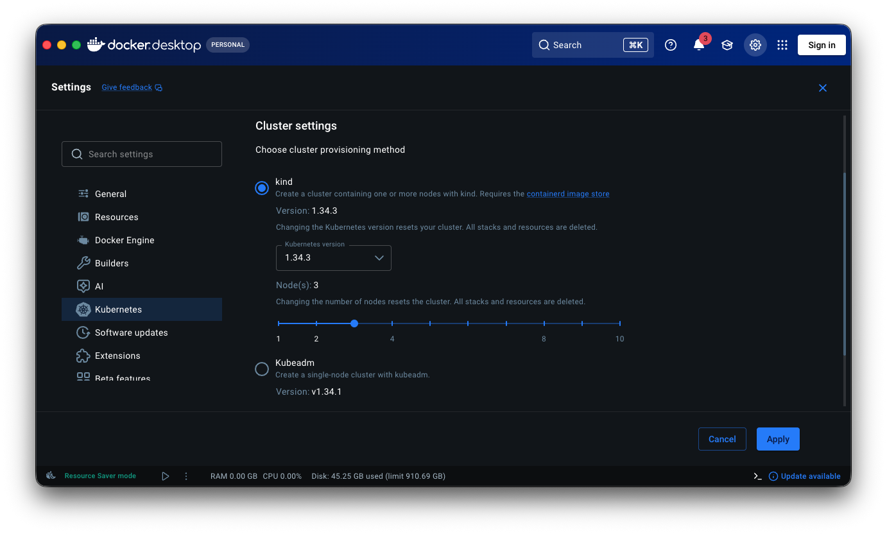
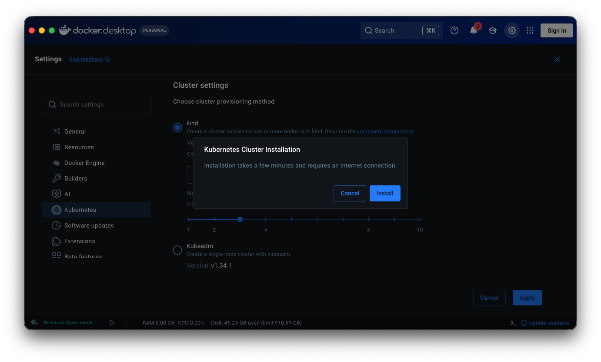
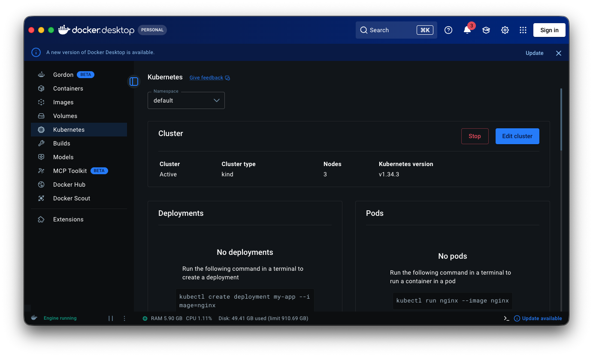
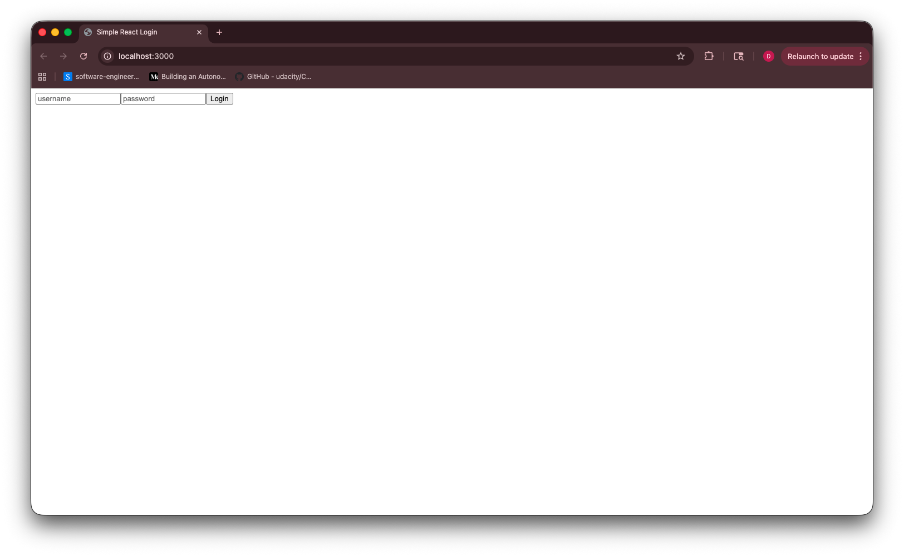
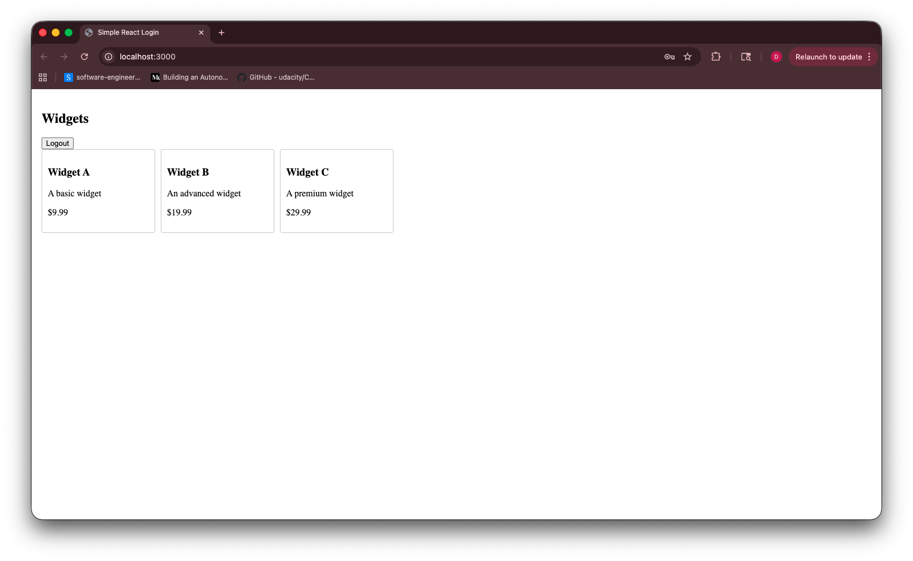
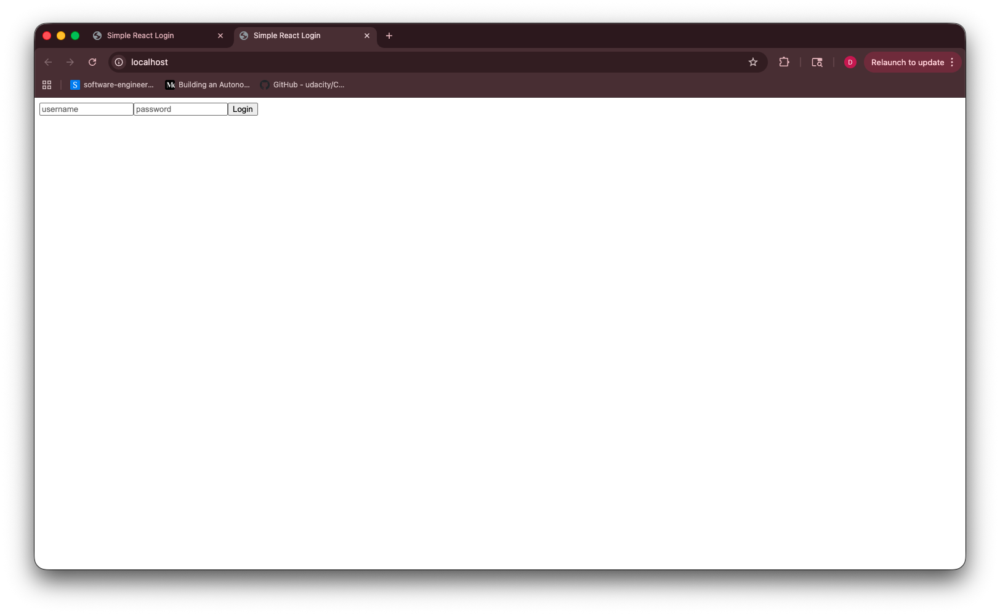

# Kubernetes Walkthrough: Docker Desktop Cluster to Deployed App

This is a single walkthrough document for both in-class teaching and student self-study.

## Audience, Time, and Outcomes

- Audience: Intro to intermediate software engineering and DevOps students
- Time: 60 to 90 minutes

Students will be able to:

- Create a local Kubernetes cluster in Docker Desktop
- Deploy Postgres and the example web app into the cluster
- Validate the app with port-forward and ingress
- Troubleshoot common local Kubernetes issues

## Prerequisites

- Docker Desktop installed and running
- Kubernetes support available in Docker Desktop
- kubectl installed
- kubectl install help:

[Install kubectl on macOS](https://kubernetes.io/docs/tasks/tools/install-kubectl-macos/)

[Install kubectl on Windows](https://kubernetes.io/docs/tasks/tools/install-kubectl-windows/)

[Install kubectl on Linux](https://kubernetes.io/docs/tasks/tools/install-kubectl-linux/)

- This repository available locally
- A terminal open in the project root

Important:

- A bare Docker Desktop Kubernetes cluster does not include an ingress controller by default.
- You must complete Step 5 before Step 6 ingress routing can work.

Before starting Step 2, make sure your terminal is in this project folder.

## Step 1: Create the Kubernetes Cluster in Docker Desktop

1. Open Docker Desktop.


Caption: Start from the Docker Desktop main dashboard.

2. Open Settings.


Caption: Open Settings.

3. Select Kubernetes in the left sidebar.


Caption: Navigate to Kubernetes settings before enabling.

4. Enable Kubernetes and confirm that Apply is available.


Caption: Enable Kubernetes and confirm Apply is active.

5. Click Apply and confirm installation if prompted.


Caption: Confirm installation.

6. Wait for Kubernetes to show as running in Docker Desktop.


Caption: Verify Kubernetes is active in Docker Desktop.

Run verification commands:

```bash
kubectl config current-context
kubectl cluster-info
kubectl get nodes
```

Checkpoint:

- Current context should be docker-desktop
- At least one node should be Ready

If the current context is not docker-desktop, switch to it:

```bash
kubectl config get-contexts
kubectl config use-context docker-desktop
kubectl config current-context
kubectl get nodes
```

Checkpoint:

- kubectl is now pointing to docker-desktop
- kubectl get nodes shows the local Docker Desktop cluster

## Step 2: Build the Local App Image

From the project root, run:

```bash
docker build -t dstrimble-example-project:local .
docker images | grep dstrimble-example-project
```

Checkpoint:

- Image exists with tag local

## Step 3: Deploy Namespace and Database

Run:

```bash
kubectl apply -f k8s/namespace.yaml
kubectl apply -f k8s/postgres.yaml
kubectl -n dstrimble-local rollout status deploy/postgres
```

Validate:

```bash
kubectl -n dstrimble-local get pods,svc,pvc
```

Checkpoint:

- postgres deployment is successfully rolled out
- postgres-data PVC is Bound

## Step 4: Deploy the Web App

Run:

```bash
kubectl apply -f k8s/app.yaml
kubectl -n dstrimble-local rollout status deploy/web
kubectl -n dstrimble-local get pods,svc
```

Checkpoint:

- web pod is Running
- web service exists on port 3000

Quick browser test with port-forward:

```bash
kubectl -n dstrimble-local port-forward svc/web 3000:3000
```

Leave that terminal window running, then open http://localhost:3000.

Demo login for this project:

- Username: admin
- Password: password

Use the browser to verify the app loads before logging in:


Caption: Browser open to http://localhost:3000 showing the app login page.

After logging in, verify the authenticated app view loads:


Caption: Browser after logging in through the direct service port-forward.

## Step 5: Install Local Ingress Controller

This step is required on a fresh Docker Desktop cluster.

Run:

```bash
kubectl apply -f https://raw.githubusercontent.com/kubernetes/ingress-nginx/main/deploy/static/provider/cloud/deploy.yaml
kubectl -n ingress-nginx wait --for=condition=ready pod -l app.kubernetes.io/component=controller --timeout=180s
kubectl -n ingress-nginx get pods,svc
```

Checkpoint:

- ingress controller pod is Ready
- ingress-nginx-controller service exists

## Step 6: Apply Ingress for the App

Run:

```bash
kubectl apply -f k8s/ingress.yaml
kubectl -n dstrimble-local get ingress
```

Open http://localhost in your browser.

Use the browser to verify the app loads through ingress:


Caption: Browser open to http://localhost showing the app login page through ingress.

After logging in, verify the authenticated app view loads through ingress:


Caption: Browser after logging in through the ingress controller.

If localhost does not route to ingress on your machine, use this fallback in a second terminal:

```bash
kubectl -n ingress-nginx port-forward service/ingress-nginx-controller 8080:80
```

Then test http://localhost:8080 in your browser.

Checkpoint:

- app is reachable through the ingress controller on localhost

## Step 7: Troubleshooting Guide

Run these checks in order:

```bash
kubectl -n dstrimble-local get all
kubectl -n dstrimble-local describe pod -l app=web
kubectl -n dstrimble-local describe pod -l app=postgres
kubectl -n dstrimble-local logs deploy/web
kubectl -n dstrimble-local logs deploy/postgres
kubectl -n ingress-nginx logs deploy/ingress-nginx-controller
```

Common issues:

- Image not found: rebuild as dstrimble-example-project:local
- Web pod crash looping: verify Postgres values in k8s/app.yaml
- PVC Pending: check local disk availability and storage class
- Ingress test fails: verify ingress controller readiness; if needed, use the localhost:8080 port-forward fallback in Step 6
- Page loads but login fails: verify you are using username admin and password password

## Step 8: Cleanup

Run:

```bash
kubectl delete -f k8s/ingress.yaml --ignore-not-found
kubectl delete -f k8s/app.yaml
kubectl delete -f k8s/postgres.yaml
kubectl delete -f k8s/namespace.yaml
```

